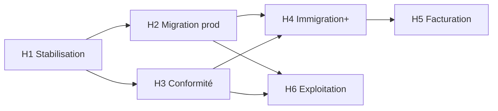

# Ada Papers — Roadmap produit & technique

> SaaS multi-tenant pour cabinets (priorité : immigration, démarches administratives, contentieux OFPRA/préfecture).  
> Dernière mise à jour : mai 2026

---

## Vision

**Ada Papers** = une plateforme unique (Vercel + API) où chaque cabinet dispose de :

- sa base MongoDB isolée ;
- son domaine, branding et emails ;
- un parcours client digital (dossier, documents, messagerie, RDV, tarification) ;
- des outils métier (recours, calculateur de délais, Lexia).

**Positionnement cible (12–24 mois)** : cabinets et structures d’accompagnement juridique **spécialisés immigration / administratif**, pas ERP généraliste type Kleos/Secib.

---

## État actuel (réalisé)

| Bloc                                            | Statut | Référence                                    |
| ----------------------------------------------- | ------ | -------------------------------------------- |
| Phase 1 — Fondations multi-tenant               | ✅      | Base maître, pool tenant, résolution Host    |
| Phase 2 — Routes métier + JWT `orgId`           | ✅      | `tenantModels`, middleware                   |
| Phase 3 — Fichiers & emails par cabinet         | ✅      | Uploads, Brevo par org                       |
| Phase 4 — Frontend tenant (branding, config)    | ✅      | `TenantProvider`, CORS                       |
| Phase 5 — Console plateforme (API + UI de base) | ✅      | `/platform`, organisations                   |
| Métier immigration                              | ✅      | Dossiers, recours, calculateur, tarification |
| Lexia / forum / CMS                             | ✅      | Modules plateforme partagés                  |

**En cours / dette immédiate**

- Stabilisation URI Mongo par cabinet (ex. `cabinet-martin` — auth Atlas).
- Console plateforme enrichie (dashboard, utilisateurs tenant, branding upload).
- Branding tenant réellement appliqué sur le site (`NEXT_PUBLIC_USE_UNIFIED_PUBLIC_BRANDING`).

---

## Principes de priorisation

1. **Stabilité tenant** avant nouvelles features.
2. **Valeur immigration** avant ERP avocat généraliste.
3. **Réutilisable multi-tenant** (toute feature cabinet = par `orgId`).
4. **Conformité** (secret professionnel, audit) avant scale commercial.

---

## Horizon 1 — Stabilisation & exploitation (0–6 semaines)

### H1.1 — Infrastructure multi-tenant (bloquant)

| #   | Livrable                             | Critère de done                                                     |
| --- | ------------------------------------ | ------------------------------------------------------------------- |
| 1   | Script sync `mongoUri` depuis `.env` | `syncTenantMongoFromEnv.js` documenté + `npm run sync:tenant-mongo` |
| 2   | Checklist onboarding cabinet         | Dupont + Martin + Wadepaw : login, dossier, doc, email              |
| 3   | Health check explicite               | Liste plateforme affiche erreur Mongo (`bad auth`, timeout)         |
| 4   | Doc ops                              | `dev-local-cabinets.md` + procédure reset mot de passe Atlas        |

### H1.2 — Console plateforme (MVP exploitable)

| #   | Livrable                   | Critère de done                                                                           |
| --- | -------------------------- | ----------------------------------------------------------------------------------------- |
| 5   | Dashboard `/platform`      | Stats, journal audit, liens rapides                                                       |
| 6   | Fiche cabinet              | Onglets : général, domaines, technique, branding, limites, utilisateurs, checklist, audit |
| 7   | Branding                   | Thèmes couleur + upload logo/favicon + aperçu                                             |
| 8   | Wizard création cabinet    | `/platform/cabinets/new`                                                                  |
| 9   | Accès depuis admin cabinet | Bouton « Console Ada Papers » (superadmin Ada Papers uniquement)                          |

### H1.3 — Branding client par cabinet

| #   | Livrable                        | Critère de done                                              |
| --- | ------------------------------- | ------------------------------------------------------------ |
| 10  | Activer branding tenant en prod | Désactiver branding unifié forcé ; variables CSS `--primary` |
| 11  | Header / favicon / titre        | Logo + couleur par domaine                                   |
| 12  | Landing `landingPage`           | Headline/CTA depuis base maître                              |

**Jalon H1** : 2 cabinets démo stables + 1 cabinet pilote configurable sans toucher au code.

---

## Horizon 2 — Migration production (6–10 semaines)

*Aligné Phase 6 du doc technique.*

| #   | Livrable                 | Critère de done                                              |
| --- | ------------------------ | ------------------------------------------------------------ |
| 13  | Cabinet pilote (Wadepaw) | Dump Mongo legacy → URI tenant + validation 1 semaine        |
| 14  | Fichiers legacy          | `migrate:uploads` + Cloudinary `migrate:cloudinary-cabinets` |
| 15  | DNS & domaines prod      | Vercel + `organizations.domains` + CORS                      |
| 16  | Plan de rollback         | Procédure écrite + test sur staging                          |
| 17  | Reconnexion utilisateurs | Communication JWT `orgId` + fenêtre maintenance              |
| 18  | Monitoring minimal       | Logs erreurs tenant, alerte pool connexions                  |

**Jalon H2** : production mono-cabinet migrée ; second cabinet ajouté sans redéploiement.

---

## Horizon 3 — Conformité & confiance cabinet (10–18 semaines)

*Réponses aux attentes « cabinet d’avocats » sans tout un ERP.*

| #   | Livrable                              | Priorité | Critère de done                                              |
| --- | ------------------------------------- | -------- | ------------------------------------------------------------ |
| 19  | Journal d’audit **par dossier**       | P0       | Qui a vu/modifié/téléchargé (horodaté)                       |
| 20  | Habilitations fines                   | P0       | Accès dossier par rôle + liste collaborateurs                |
| 21  | Convention d’honoraires               | P1       | Modèle PDF + stockage + lien dossier                         |
| 22  | Vérification conflits d’intérêts (v1) | P1       | Recherche nom/email/partie adverse avant ouverture           |
| 23  | Export dossier / RGPD                 | P1       | Export ZIP client + trace demande                            |
| 24  | Signature électronique (v1)           | P2       | Intégration tiers (YouSign / DocuSign) ou upload signé tracé |
| 25  | Chiffrement secrets maître            | P0       | `mongoUri`, `brevoApiKey` chiffrés au repos                  |
| 26  | DPA / doc hébergement UE              | P1       | Atlas EU, Brevo, IA — document client                        |

**Jalon H3** : un cabinet peut justifier l’usage auprès d’un client institutionnel (audit + secret).

---

## Horizon 4 — Métier immigration renforcé (18–30 semaines)

| #   | Livrable                    | Critère de done                                      |
| --- | --------------------------- | ---------------------------------------------------- |
| 27  | Calculateur délais v2       | Plus de procédures, export PDF, lien dossier         |
| 28  | Workflow recours            | Étapes types OFPRA/préfecture/CNDA + échéances auto  |
| 29  | Dépôt tiers / invités       | Parcours invité documentaire sécurisé (durcissement) |
| 30  | Notifications procédure     | SMS/email sur jalons (convocation, délai J-7)        |
| 31  | Lexia tenant-aware (option) | Contexte limité au cabinet / dossier (RGPD)          |
| 32  | Portail partenaire          | Consulat/association : vue dossiers référés          |

**Jalon H4** : différenciation forte vs « simple GED + messagerie ».

---

*Uniquement si validation marché — sinon report.*

| #   | Livrable                     | Critère de done                                                 |
| --- | ---------------------------- | --------------------------------------------------------------- |
| 33  | Saisie du temps (diligences) | Lien dossier + utilisateur + durée                              |
| 34  | Grille tarifaire             | TJM / forfait par avocat ou type d’acte                         |
| 35  | Note d’honoraires            | Génération PDF + statut (brouillon, envoyée, payée)             |
| 36  | Provisions & solde dossier   | Encaissements, imputation (hors compte séquestre réglementé v1) |
| 37  | Relances & export compta     | CSV / export simple                                             |

**Jalon H5** : facturation « cabinet petit/moyen » sans remplacer expert-comptable.

---

## Horizon 6 — Exploitation & scale (continu)

*Aligné Phase 7.*

| #   | Livrable                       | Fréquence                             |
| --- | ------------------------------ | ------------------------------------- |
| 38  | Tests anti-fuite cross-tenant  | Chaque release                        |
| 39  | Sauvegardes par URI tenant     | Hebdo + test restauration trimestriel |
| 40  | Suspension `status: suspended` | Ops + UI plateforme                   |
| 41  | Limites `maxUsers` / stockage  | Enforcement + alertes                 |
| 42  | SLA & support N2               | Contrat commercial                    |
| 43  | Multi-bureaux (option)         | Sous-structure dans un tenant         |

---

## Ce qui est volontairement hors scope (v1–v2)

- ERP complet civil/pénal/affaires (audiences, RPVA, conclusions types).
- Compte de séquestre réglementé niveau barreau (projet dédié + partenaire compta).
- CRM commercial avancé (pipelines, campagnes).
- Remplacement total Kleos / Secib / Diapaz.

---

## Jalons résumés

| Jalon  | Date cible | Résultat                                    |
| ------ | ---------- | ------------------------------------------- |
| **M0** | +6 sem     | 2 tenants stables + console + branding      |
| **M1** | +10 sem    | Prod pilote migrée                          |
| **M2** | +18 sem    | Conformité dossier + secrets chiffrés       |
| **M3** | +30 sem    | Immigration « best in class »               |
| **M4** | +42 sem    | Facturation temps/honoraires (si GO marché) |

---

## Dépendances

---

## Métriques de succès

| Métrique                             | Cible                     |
| ------------------------------------ | ------------------------- |
| Temps onboarding nouveau cabinet     | < 2 h (console, sans dev) |
| Incidents cross-tenant               | 0                         |
| Uptime API tenant                    | > 99,5 %                  |
| Cabinets actifs sur domaine dédié    | +1 / trimestre post-M1    |
| Délai moyen ouverture dossier client | < 24 h                    |

---

## Références

| Document                                                                                        | Contenu                         |
| ----------------------------------------------------------------------------------------------- | ------------------------------- |
| `[projet saas multi tenant.md](../projet%20saas%20multi%20tenant.md)`                           | Architecture & phases 1–7       |
| `[backend/docs/dev-local-cabinets.md](../backend/docs/dev-local-cabinets.md)`                   | Dev local Dupont/Martin/Wadepaw |
| `[backend/docs/cabinet-dupont-comptes-demo.md](../backend/docs/cabinet-dupont-comptes-demo.md)` | Comptes démo Dupont             |
| `[backend/docs/cabinet-wadepaw-migration.md](../backend/docs/cabinet-wadepaw-migration.md)`     | Migration Wadepaw               |

**URLs console**

- Connexion : `http://localhost:3004/platform/signin`
- Dashboard : `/platform`
- Cabinets : `/platform/cabinets`

---

## Historique des révisions

| Date    | Changement                                                |
| ------- | --------------------------------------------------------- |
| 2026-05 | Création roadmap consolidée (technique + produit cabinet) |

